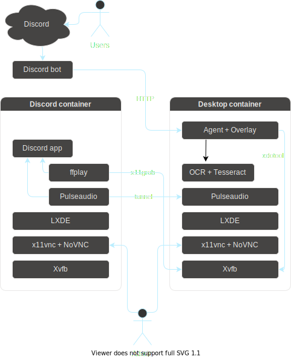

# Discord Plays Linux

A shared Linux container that can be controlled by anyone on Discord.

## Bot commands

| Command      | Description                                          |
| ------------ | ---------------------------------------------------- |
| `m<x>,<y>`   | Move the mouse by the given offset.                  |
| `M<x>,<y>`   | Move the mouse to the given position.                |
| `l<x>,<y>`   | Drag the mouse by the given offset.                  |
| `L<x>,<y>`   | Drag the mouse to the given position.                |
| `f <text>`   | Move mouse cursor to the given text (uses OCR).      |
| `c`          | Click the mouse.                                     |
| `rc`         | Right-click the mouse.                               |
| `mc`         | Middle-click the mouse.                              |
| `u`, `uu`, … | Scroll the mouse wheel up (by the number of `u`s).   |
| `d`, `dd`, … | Scroll the mouse wheel down (by the number of `d`s). |
| `k <key> …`  | Press the keyboard key.                              |
| `t <text>`   | Type the given text.                                 |
| `e`          | Press the enter key.                                 |
| `y <text>`   | Copy the given text to the clipboard.                |

## Components

- Two desktop Linux containers:
  - `discord` for connecting to Discord.
  - `desktop` for the actual desktop.
- An agent to control the VM.
- A Discord bot that talks to the agent.



## Notes for server operators

```sh
# Start all services
docker-compose up -d

# Tail logs
docker-compose logs --tail=100 -f

# Access desktop as root
docker-compose exec desktop bash

# Access desktop as desktop user
docker-compose exec desktop su desktop

# Restart agent (sometimes required when transparency is not working)
docker-compose exec desktop supervisorctl restart agent

# Tail agent logs
docker-compose exec desktop supervisorctl tail -f agent

# Pipe sound from desktop to Discord
pacmd load-module module-tunnel-source server=desktop source=virtual.monitor source_name=desktop

# Pipe video from desktop to Discord
ffplay -fs -f x11grab -video_size 1280x720 -i desktop:1.0
```
