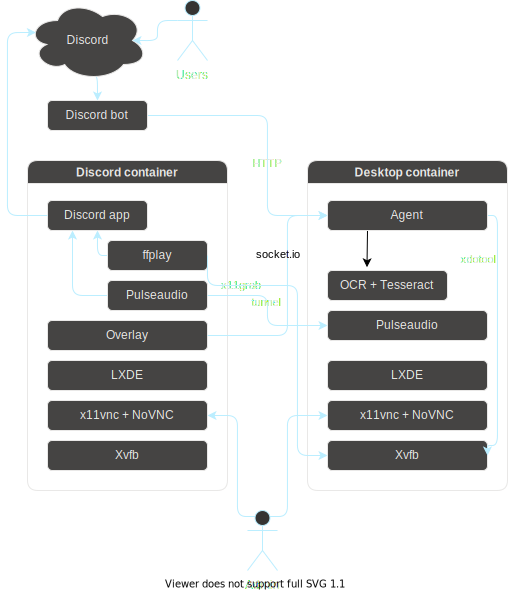

# shared-desktop-on-discord

A shared Linux container that can be controlled by anyone on Discord.

## Components

- Two desktop Linux containers:
  - `discord` for connecting to Discord.
  - `desktop` for the actual desktop.
- An agent to control the VM.
- A Discord bot that talks to the agent.



## Notes

```sh
docker-compose exec desktop su desktop
yarn --cwd=/opt/agent start
load-module module-tunnel-source server=desktop source=virtual.monitor source_name=desktop
ffplay -fs -f x11grab -video_size 1280x720 -i desktop:1.0
```
